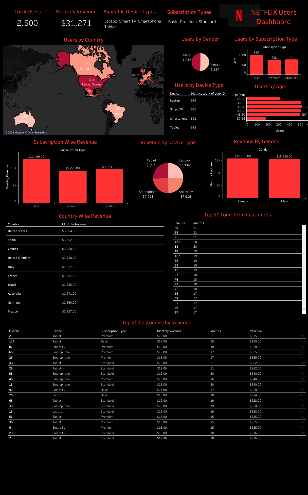

# Netflix Userbase Analysis

## Project Title : 
Netflix Userbase Analysis - Data visualization (Using Tableau)

## Project Description : 
The dataset provides a snapshot of a sample Netflix userbase, showcasing various aspects of user subscriptions, revenue, account details, and activity. Each row represents a unique user, identified by their User ID. The dataset includes information such as the user's subscription type (Basic, Standard, or Premium), the monthly revenue generated from their subscription, the date they joined Netflix (Join Date), the date of their last payment (Last Payment Date), and the country in which they are located.

Additional columns have been included to provide insights into user behavior and preferences. These columns include Device Type (e.g., Smart TV, Mobile, Desktop, Tablet) and Account Status (whether the account is active or not). The dataset serves as a synthetic representation and does not reflect actual Netflix user data. It can be used for analysis and modeling to understand user trends, preferences, and revenue generation within a hypothetical Netflix userbase.

## Link to the Dashboard

<a href="https://public.tableau.com/app/profile/harish.kashaboina/viz/NetFlixUsersDashboard/Dashboard1" target="_blank" rel="noopener noreferrer">
  Netflix userbase Dashboard
</a>

##  Netflix userbase Dashboard

## Data preview 
Dataset contains 10 columns and are like - 
1. User ID
2. Subscription Type
3. Monthly Revenue
4. Join Date 
5. Last Payment Date
6. Country
7. Age
8. Gender
9. Device
10. Plan Duration

## Insights: 

## Tools and Language : 

Jupyter Notebook (Python) : Used for basic understanding like structure of data (row and columns), checking null values, handling missing values etc.

Tableau : For visualization of data,interactivity and seamless experience that comes with the dashboard. 

## Link to the Tableau Profile

<a href="https://public.tableau.com/app/profile/harish.kashaboina" target="_blank" rel="noopener noreferrer">
 My Tableau Profile
</a>